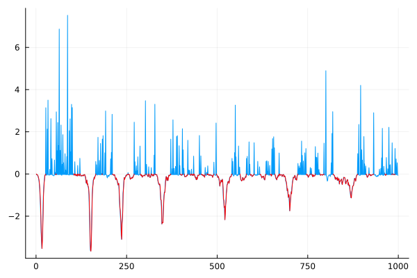
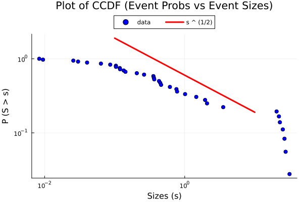

# JCommonCode

Dahmen Research Group's common code written in Julia. Functionalities are added on a use-first basis. Hopefully everything from the Python version will be added, **eventually**. Currently, the project has no real user manual (except docstrings for functions and some comments). It is assumed (for now)
that the user is somewhat familiar with Julia.

## Installation

_It is assumed that you already have Julia installed_

1) Clone the respository somewhere familiar on your device.

2) Open the Julia REPL and type ']' to enter package mode.

3) In the package mode, type **add _path-to-JCommonCode_**; the package should be automatically added
    with all of its dependecies taken care of by Julia.

4) Now you can go back to the REPL screen with **BACKSPACE**, and type **using JCommonCode** to start using!

## Current Developers and Maintainers:

_If you find any bug and/or problem, report to one of the following people_

1) Punnatorn Thienkingkeaw (Porpun)

## Testing Status

**Functionalities Currently All Tested: Working As Intended**

Slips regions (red) plotted on Dstress (blue)

Scaling law plot for 1000 Samples and Comparison Line for s^(1/2)

## Current Supported Functionalities

**Utilities**\
readline_data()\
readline_data_bundle()\
cumulative_trapz_int()\
sliding_median()\
unique_count()\
power_linemaker()\
scaling_plot()

**Slips Calculation**\
get_slips()\
get\_slips\_vel()

**CCDF/CDF**\
ccdf()\
cdf()

**More Coming in the Future**